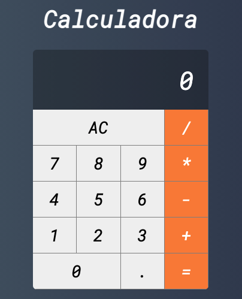

    
    <h1>
        Calculadora - ReactJs
    </h1>
    <h4>
      Projeto desenvolvido durante o curso "Web Moderno Completo com JavaScript 2021" disponibilizado pela <b>COD3R</b>.
    </h4>
     
     

  
   
   ---

   
   

<h2 id="conteudos">Conteúdos</h2>

[➜ Sobre o projeto](#mag_right-sobre-o-projeto) 
[➜ O que aprendi](#books-o-que-aprendi) 
[➜ Próximos passos](#próximos-passos) 

---

## :mag_right: Sobre o projeto

O objetivo do projeto foi deselvolver uma calculadora (similar à calculadora do sistema IOS) para revisar alguns dos principais conceitos de <b>ReactJs</b>.

---

## :books: O que aprendi

Entender de forma prática a estrutura e organização de um projeto em <b>ReactJs</b>, manipular o <i>state</i> de um componente e interagir com <i>eventos</i> e <i>props</i> na árvore desenvolvida.

Aprimorar os conhecimentos de CSS com Grid layout.

## Próximos passos

Para aproveitar a aplicação nos meus estudos, seguirei com os próximos passos:

- Refatorar parte lógica da calculadora (criar meu próprio código de cálculo da aplicão).